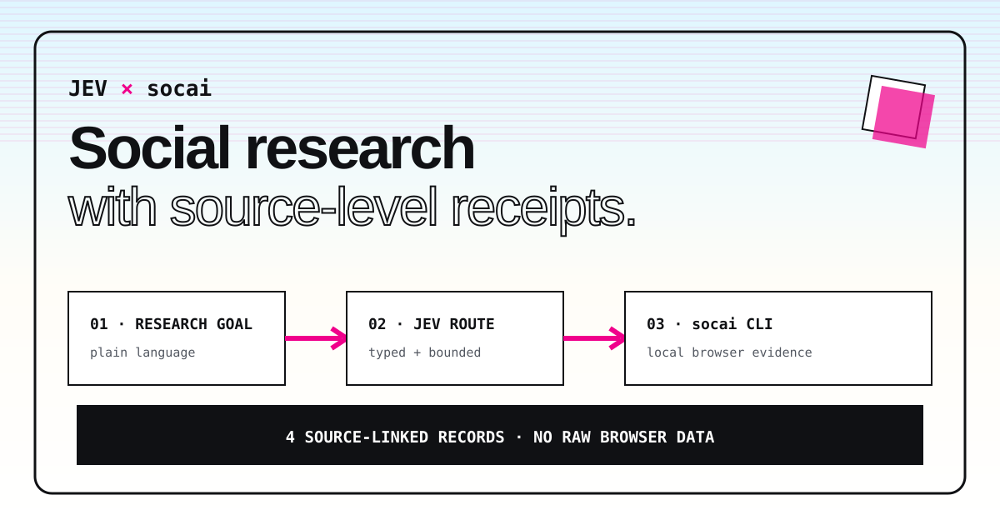

# Jev Social Research Agent

> Route a social research goal with Jev, collect evidence through the local socai CLI, and synthesize a source-linked brief with Nebius Token Factory.

This advanced-agent example demonstrates a narrow decision boundary between model inference and browser execution. [Jev](https://typesafe.ai/) selects exactly one typed route; [socai](https://github.com/socai-io/socai) performs one read-only search in a browser session it already supports; and a [Nebius Token Factory](https://tokenfactory.nebius.com/) model synthesizes only the projected, source-linked evidence. The Python adapter validates all three boundaries and retains only public evidence fields and platform URLs.

It is a compact reference implementation of the pattern used by [Jev Social](https://github.com/socai-io/jev-social), not a replacement for its multi-step research UI.

## 🚀 Features

- **Typed Jev routing**: Instagram, TikTok, LinkedIn, or an explicit unsupported outcome.
- **Bounded local execution**: fixed `socai <platform> search` command shape, no shell, timeout, result limit, and combined output cap.
- **Credential isolation**: the OpenRouter and Nebius keys are removed from the socai child environment.
- **Evidence contract**: unknown fields, local paths, raw diagnostics, and non-platform URLs are discarded.
- **Evidence-linked Nebius synthesis**: each model-generated claim must cite one or more captured evidence IDs and is labeled as unverified model output.
- **Auditable report**: source links, comparison table, limitations, route confidence, model identity, and measured timing.
- **Offline demo**: deterministic fixture and tests run without an API key, browser, or network.

## 🛠️ Tech Stack

- **Python 3.10+**: standard library only.
- **Jev Decisions API**: typed route selection through OpenRouter.
- **socai CLI**: local-browser social evidence collection.
- **Nebius Token Factory**: OpenAI-compatible evidence-linked synthesis with `Qwen/Qwen3-30B-A3B` by default.
- **unittest**: deterministic integration and security checks.

## Workflow

```text
research goal
     │
     ▼
Jev choice: instagram_search | tiktok_search | linkedin_search | unsupported
     │                              rejected ───────────────────────┐
     ▼                                                            │
validated platform ──▶ fixed local socai search ──▶ untrusted JSON │
                                                        │          │
                                                        ▼          │
                              URL allowlist + public-field projection
                                                        │
                                                        ▼
                                  Nebius evidence-linked synthesis
                                                        │
                                                        ▼
                                             source-linked brief
```

Jev never writes a command. Its answer is accepted only when it matches the closed route schema and any explicitly selected platform. `subprocess.Popen` receives an argument list directly, and the adapter forwards neither API key to the child process. The resulting JSON is treated as untrusted data before projection. Nebius receives only those projected public fields, and every synthesized finding must cite a valid evidence ID before it can enter the report. Citation IDs expose which records were supplied; they do not prove that a model claim is supported, so synthesis remains explicitly labeled as unverified.

## 📦 Getting Started

### Prerequisites

- Python 3.10 or newer.
- For the live path: an [OpenRouter API key](https://openrouter.ai/keys), a [Nebius Token Factory API key](https://tokenfactory.nebius.com/), a compatible [socai CLI](https://github.com/socai-io/socai), and a browser session supported by socai.
- No credentials or browser are required for the fixture demo and tests.

### Environment Variables

Complete the installation below first, then run these commands from `awesome-ai-apps/advance_ai_agents/jev_social_research_agent`.

#### Bash

```bash
cp .env.example .env
set -a && source .env && set +a
```

#### PowerShell

```powershell
Copy-Item .env.example .env
Get-Content .env | ForEach-Object {
  if ($_ -match '^\s*([^#][^=]*)=(.*)$') {
    [Environment]::SetEnvironmentVariable($matches[1].Trim(), $matches[2].Trim(), 'Process')
  }
}
```

```env
OPENROUTER_API_KEY=your_openrouter_api_key
NEBIUS_API_KEY=your_nebius_token_factory_api_key
OPENROUTER_JEV_MODEL=~typesafe/jev-latest
NEBIUS_MODEL=Qwen/Qwen3-30B-A3B
SOCAI_BIN=socai
```

`OPENROUTER_JEV_MODEL`, `NEBIUS_MODEL`, and `SOCAI_BIN` are optional. The example does not send either API key to the socai process. Use `--no-synthesis` when an evidence-only report is preferred and the projected records should not leave the local machine.

### Installation

#### Bash

```bash
git clone https://github.com/Arindam200/awesome-ai-apps.git
cd awesome-ai-apps/advance_ai_agents/jev_social_research_agent
python -m venv .venv
source .venv/bin/activate
python -m pip install -r requirements.txt
```

#### PowerShell

```powershell
git clone https://github.com/Arindam200/awesome-ai-apps.git
Set-Location awesome-ai-apps/advance_ai_agents/jev_social_research_agent
py -m venv .venv
.\.venv\Scripts\Activate.ps1
py -m pip install -r requirements.txt
```

## ⚙️ Usage

Run the complete offline demo first:

```bash
python main.py "Find emerging AI creator formats on Instagram" --fixture
python main.py "Find emerging AI creator formats on Instagram" --fixture --format json --output report.json
```

Run a live, bounded search:

```bash
python main.py "Find emerging AI creators on TikTok" --platform auto --limit 4
```

Write the source-linked Markdown report to disk:

```bash
python main.py "Compare AI creator formats on Instagram" --limit 4 --output report.md
```

Use `--format json --output report.json` for the stable machine-readable schema. Add `--no-synthesis` to omit the Nebius call and produce an evidence-only report. The live command prints only the projected report. It does not print the raw socai response, local artifact paths, the full command, or browser diagnostics.

### Test

```bash
python -m unittest discover -s tests -v
```

The tests cover malformed Jev output, explicit-route conflicts, shell-like query text, both credential boundaries, bounded subprocess output, URL filtering, terminal-control and Markdown neutralization, Nebius request projection and size bounds, citation validation, redirect refusal, provider throttling, response deadlines, deterministic JSON output, and the offline end-to-end path.

## Example output

```markdown
# Jev × socai social research brief

**Goal:** Find emerging AI creator formats on Instagram
**Route:** instagram at 91% confidence

## Evidence snapshot

Captured 4 source-linked records. The notes below restate only text and metrics present in the captured evidence.

## Nebius model synthesis — verify against evidence

**Unverified model summary:**

The four records favor compact, process-led formats over unsupported platform-wide conclusions.
```

## 📂 Project Structure

```text
jev_social_research_agent/
├── assets/workflow.svg
├── fixtures/sample_socai.json
├── tests/test_main.py
├── .env.example
├── main.py
├── README.md
└── requirements.txt
```

## Safety and limits

- This example exposes search only. It does not publish, like, follow, message, or change a remote account.
- Unless `--no-synthesis` is used, the goal and projected public evidence fields are sent to Nebius Token Factory; raw socai output and local fields are not.
- Nebius synthesis is unverified model output. Citation IDs identify inputs, but users must open the linked records to verify each claim.
- A successful command does not imply representative coverage. Empty, partial, login-gated, challenged, and rate-limited outcomes stay explicit.
- Platform responses and browser behavior can change. Review source posts before consequential use.
- Use a browser profile appropriate for research and follow each platform policy.

## 🤝 Contributing

Contributions are welcome. Please follow the repository [contribution guide](../../CONTRIBUTING.md).

## 📄 License

This example is distributed under the repository MIT license.

## 🙏 Acknowledgments

- [Jev by TypeSafe](https://typesafe.ai/) for typed decision routing.
- [Nebius Token Factory](https://tokenfactory.nebius.com/) for evidence-linked synthesis.
- [socai](https://github.com/socai-io/socai) for local-browser social workflows.
- [Jev Social](https://github.com/socai-io/jev-social) for the browser-grounded research pattern.
